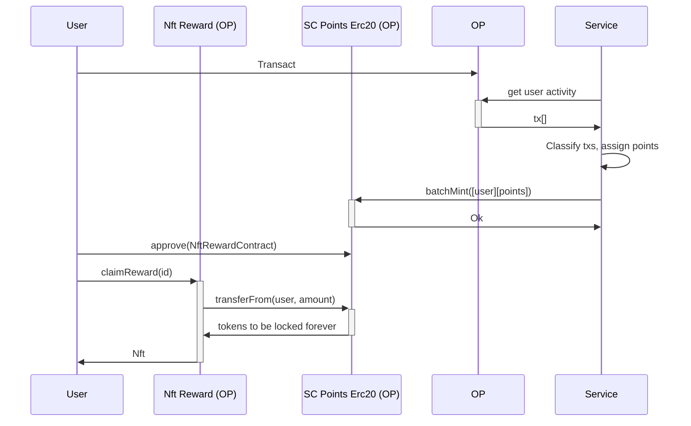
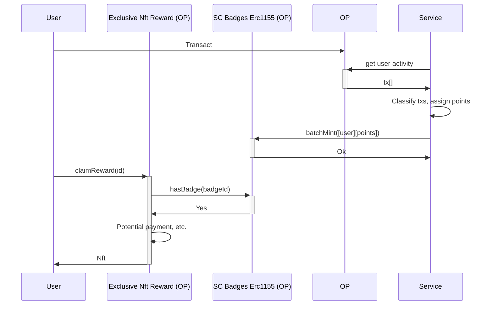

# Gamification

## Overview

Our gamification system is designed to incentivize user activity across OP Chains. Users earn points for various on-chain actions and can exchange them for rewards. Additionally, non-transferable badges recognize significant achievements and unlock exclusive benefits.

## Points

SC Points are ERC-20 tokens minted upon achieving specific actions or through raffles. They are transferable, allowing users to exchange them for valuable assets. Ideally points are used just once to redeem a reward and then taken out of circulation to further encourage engagement. The SC Points will be a [Superchain ERC20](https://docs.optimism.io/stack/interop/tutorials/deploy-superchain-erc20) so they can be easily used across chains, initially issued in the chain where the achievement was unlocked, or in optimism mainnet for ecosystem-wide badges. In particular we'll have a off-chain service monitoring events and submitting mint batches to the relevant chains. There can be multiple potential prizes, to kick it off we'll start by offering an exclusive collection of NFTs.

### How it works

An example flow could be:

**Note**: The SC Points are a standard ERC20, so we empower anybody to use them as they see fit, in here we're just selling an NFT and locking the tokens to further encourage chain engagement, but it's just an example, more applications can be build to give utility to the SC Points.

### Issuance

SC Points are awarded based on user engagement:

#### **Basic Transactions**

| **Event**                | **Description**                                                           | **Points Suggested** | **Frequency**      |
| ------------------------ | ------------------------------------------------------------------------- | -------------------- | ------------------ |
| **Transaction Sent**     | Sending any transaction on OP Mainnet, Base, or other OP Chains.          | 1 SC Point           | Per transaction    |
| **Unique Chain Use**     | Interacting with a new OP Chain for the first time.                       | 20 SC Points         | One-time per chain |
| **Days Active**          | Being active on-chain on OP Chains for a certain number of days per week. | 5 SC Points          | Weekly             |
| **Milestone Completion** | Hitting transaction milestones (e.g., 100, 500 transactions).             | 50 SC Points         | Per milestone      |

---

#### **DeFi Engagement**

| **Event**                  | **Description**                                                                            | **Points Suggested** | **Frequency**         |
| -------------------------- | ------------------------------------------------------------------------------------------ | -------------------- | --------------------- |
| **Token Swap**             | Swapping tokens on DEXs (e.g., Uniswap, Velodrome).                                        | 2 SC Points          | Per swap              |
| **Liquidity Pool Deposit** | Adding liquidity to a pool.                                                                | 5 SC Points          | Per pool deposit      |
| **Staking Tokens**         | Staking assets in a protocol.                                                              | 10 SC Points         | Per staking event     |
| **Holding Assets**         | Holding OP, ETH, stablecoins, or NFTs for a specified timeframe (e.g., 1 week to 1 month). | 10–50 SC Points      | Per holding timeframe |

---

#### **Governance Participation**

| **Event**             | **Description**                                   | **Points Suggested** | **Frequency** |
| --------------------- | ------------------------------------------------- | -------------------- | ------------- |
| **Governance Voting** | Voting on Snapshot or other governance platforms. | 10 SC Points         | Per vote      |
| **Proposal Creation** | Creating a governance proposal.                   | 25 SC Points         | Per proposal  |

---

#### **NFT Engagement**

| **Event**        | **Description**                                              | **Points Suggested** | **Frequency** |
| ---------------- | ------------------------------------------------------------ | -------------------- | ------------- |
| **NFT Minting**  | Minting a new NFT (e.g., Superchain badges or collectibles). | 5 SC Points          | Per mint      |
| **NFT Transfer** | Sending an NFT to another wallet.                            | 2 SC Points          | Per transfer  |

---

## Badges

Badges are non-transferable ERC-1155 NFTs awarded for specific achievements. They serve as proof of engagement and unlock various blockchain benefits. These will be issued in the chain where the achievement was unlocked, or in optimism for ecosystem-wide badges. In particular we'll have a off-chain service monitoring events and submitting mint batches to the relevant chains.

Some example use cases can be:

- Unlocking NFTs from a collection
- Unlocking rewards from a raffle
- Unlocking testnet tokens
- Unlocking promotional prices for swaps
- Unlocking airdrop participation
- Unlocking raffle participation
- Etc

Why non-transferable:
- Badges provide exclusive benefits such as access to raffles, special NFTs, and promotional rates. Making them non-transferable prevents users from passing them around to exploit rewards. Only those who achieved these badges should be rewarded incentivizing this way the engagement of more users.

### How it works

An example flow could be:

**Note**: In this case we're giving the nft for free, for the simple fact of having the badge. This is optional, we could add on top payments, with points or any other token. Another important fact is Exclusive Nft Reward contract is not attached to the system itself, so anybody can build on top of the SC Badges Erc1155 contract.

### Issuance

We will issue badges for milestones in activity, leaving room for future expansions:

Activity-Based Badges
- {25,50,100} Days active on {chain}
- {25,50,100} Days active on the Superchain
- {25,50,100} Transactions on {chain}
- {25,50,100} Transactions on the Superchain
- {25,50,100} Defi interactions on {chain}
- {25,50,100} Defi interactions on the Superchain

Future updates may introduce additional badge types based on user feedback and ecosystem developments.

## Points raffle

To further enhance user engagement, we have introduced the **Points Raffle** system. Participation is exclusive to users who hold badges, with ticket distribution based on badge ownership. Each raffle round may feature different prizes and eligibility conditions, but in general, tickets will be allocated based on users' achievements.  

For example, if a raffle focuses on activity, users with **25 days of activity** might receive **10 tickets**, while those with **50 days of activity** could get **20 tickets**, and so on. This approach rewards committed users with better odds while still keeping the system accessible to newcomers. Additionally, all participants must manually claim their raffle entry, increasing on-chain interactions and maintaining user engagement.

The prize will always be SC points that can later be exchanged in the marketplace.

## Summary

Our gamification framework fosters increased user participation across OP Chains through SC Points and Badges. SC Points function as an incentive mechanism, while non-transferable Badges offer exclusive perks. Together, they create an engaging, rewarding, and secure ecosystem that benefits users and the broader Superchain network.