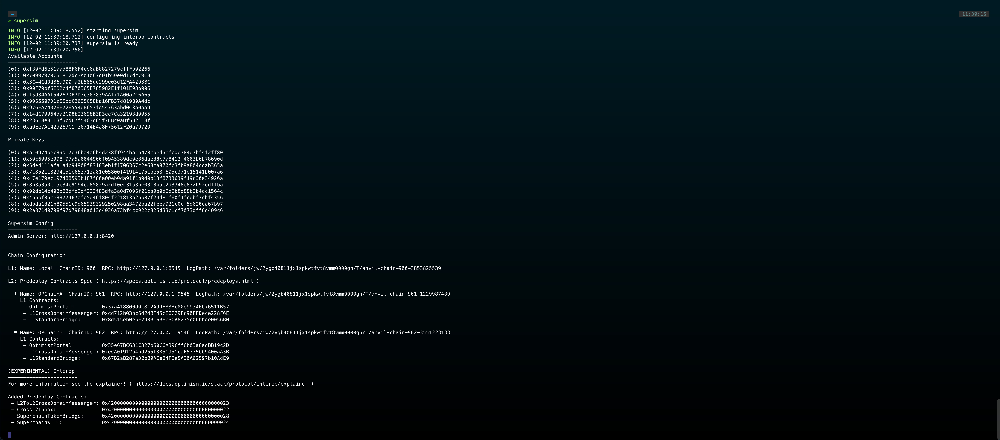

# Superchain App - Local environment set up

The following document provide steps to run the Superchain POC app in a local environment

## Set up steps

### 1 - Install and start Supersim

[Supersim](https://supersim.pages.dev/introduction) is a lightweight tool to simulate the OP Superchain (with a single L1 and multiple OP-Stack L2s). This tools allow us to run multiple local nodes with one command, and coordinate message passing between these chains.

Go to [getting-started](https://supersim.pages.dev/getting-started/installation) section part of the documentation and follow the steps to install it locally. Once installed run the command `supersim` in a new terminal to start it up, you should see something like this:



Take note of these configuration from the output as they will be needed in the following steps:

- Available Accounts and Private Keys
- L2 Op chain name
- L2 Op chain ID
- L2 Op chain RPC

### 2 - Deploy contracts

ERC-4337 standard should be deployed in the local chain to allow the application to create Smart Accounts and interact with them.

Follow the steps provided in [wakeup-erc-4337](../../apps/wakeup-erc-4337/README.md#local) documentation to deploy the contracts and adding deposits to the deployed paymaster. You will need to provide several env configurations to run the scripts, take them from supersim:

- `LOCAL_OP_CHAIN_ID`: Use one of the `L2 Op chain ID` provided.
- `LOCAL_OP_CHAIN_NAME`: Use the chain name associated to the Chain ID previously selected.
- `LOCAL_OP_RPC_URL`: Use the chain RPC associated to the Chain ID previously selected.
- `LOCAL_PRIVATE_KEY`: Use one of the `Private Keys`. As stated in the documentation this wallets needs to be funded in order to transfer funds to the Paymaster contract. You will not have to worry about this as they were funded on supersim start up.

Save all the contracts' address (Entrypoint, Paymaster, SmartAccount Factory, Counter), they will be needed in next steps.

**Note:** you will need to deploy the contracts every time you restart supersim

### 3 - Start Paymaster Client

The Paymaster client is in charge of mediate between the bundler and the paymaster contract. the paymaster will be the one who sponsors the Smart Account operations, allowing them to be abstracted from paying gas.

Follow the steps provided in [wakeup-paymaster-client](../../apps/wakeup-paymaster-client/README.md) documentation. Provide a `PORT` of your choice and set the Paymaster address from [Step 2](#2---deploy-contracts) as `PAYMASTER_ADDRESS`.

### 4 - Start the Bundler

The bundler coordinates the calls between the user and the entrypoint contract.

- Clone the [alto-smart-account-bundler](https://github.com/wakeuplabs-io/pimlico-alto-smart-account-bundler), follow the documentation steps to install and build the project.
- Prior to start the bundler you need to provide a json configuration file, here is an example:

```json
{
  "entrypoints": "0xe7f1725E7734CE288F8367e1Bb143E90bb3F0512",
  "executor-private-keys": "0x59c6995e998f97a5a0044966f0945389dc9e86dae88c7a8412f4603b6b78690d,0x5de4111afa1a4b94908f83103eb1f1706367c2e68ca870fc3fb9a804cdab365a",
  "utility-private-key": "0xac0974bec39a17e36ba4a6b4d238ff944bacb478cbed5efcae784d7bf4f2ff80",
  "rpc-url": "http://127.0.0.1:9545",
  "safe-mode": false,
  "deploy-simulations-contract": true,
  "port": 4337,
  "polling-interval": 100,
  "max-block-range": 10000
}
```

Use the data from previous steps to populate the config file:

- `entrypoints`: Address of the entrypoint deployed from [Step 2](#2---deploy-contracts).
- `executor-private-keys`: Use two of the private keys provided by Supersim (can be the one used for deploying in [Step 2](#2---deploy-contracts)).
- `utility-private-key`: Use one of the private keys provided by Supersim. It should be different form the ones used as `executor-private-keys`.
- `rcp-url`: RPC url of the chain where contracts were deployed.
- `safe-mode`: Enable/Disable safe mode (enforcing all ERC-4337 rules). For the moment set it to `false`
- `deploy-simulations-contract`: Set it to `true` always. It will deploy a required contract to simulate entrypoint calls.
- `port`: The port which the bundler will listen to. Use one of your choice.
- `polling-interval`: Polling interval for querying for new blocks (ms).
- `max-block-range`: Max block range for getLogs calls

### 5 - Start the application POC

Follow the steps provided in [superchain-app-poc](../../apps/superchain-app-poc/README.md#local-setup) documentation to start the application locally. Use the data from previous steps as required environment variables values:

- `VITE_RAINBOW_KIT_PROJECT_ID`: Create a new one from https://cloud.walletconnect.com/
- `VITE_LOCAL_CHAIN_ID`: Same Chain ID as in [Step 2](#2---deploy-contracts).
- `VITE_LOCAL_CHAIN_NAME`: Same Chain Name as in [Step 2](#2---deploy-contracts).
- `VITE_ENTRYPOINT_ADDRESS`: Get it from the addresses of [Step 2](#2---deploy-contracts).
- `VITE_SMART_ACCOUNT_FACTORY_ADDRESS`: Get it from the addresses of [Step 2](#2---deploy-contracts).
- `VITE_RPC_TRANSPORT_URL`: Same RPC as in [Step 2](#2---deploy-contracts).
- `VITE_BUNDLER_URL`: url (with port) of the local bundler
- `VITE_PAYMASTER_CLIENT_URL`: url (with port) of the paymaster client
- `VITE_COUNTER_CONTRACT_ADDRESS`: Get it from the addresses of [Step 2](#2---deploy-contracts).

### 6 - Set up local network in Metamask

Add a new manual network to metamask using the following configuration:

- **Network name**: Same Chain Name as in [Step 2](#2---deploy-contracts).
- **New RPC URL**: Same RPC as in [Step 2](#2---deploy-contracts).
- **Chain ID**: Same Chain ID as in [Step 2](#2---deploy-contracts).
- **Currency symbol**: ETH
