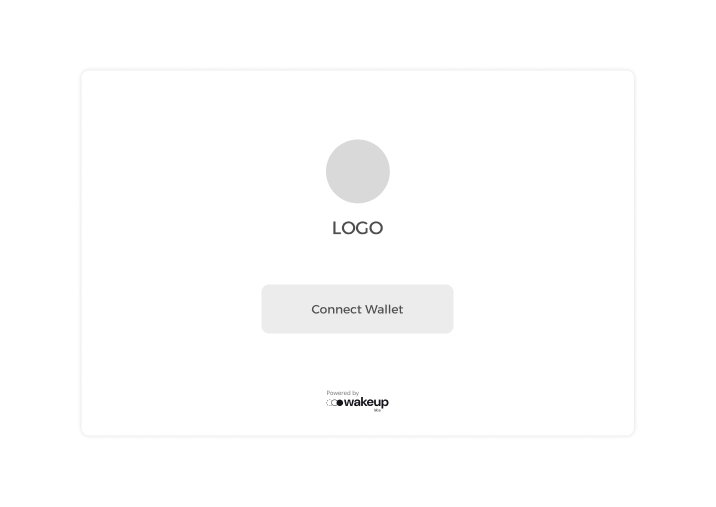
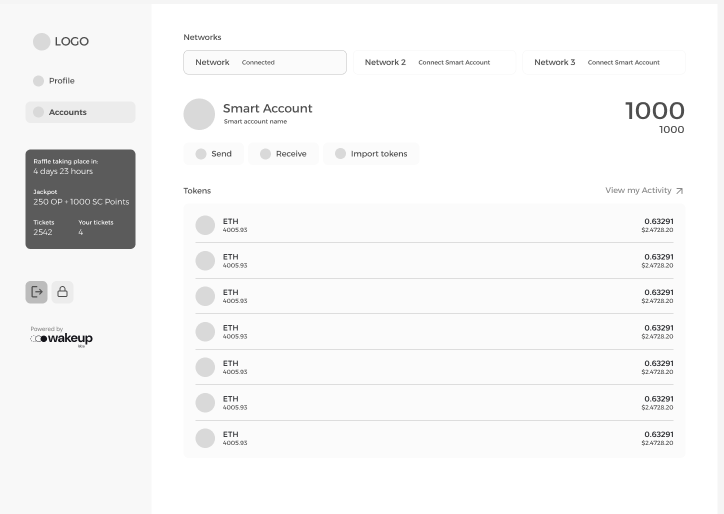
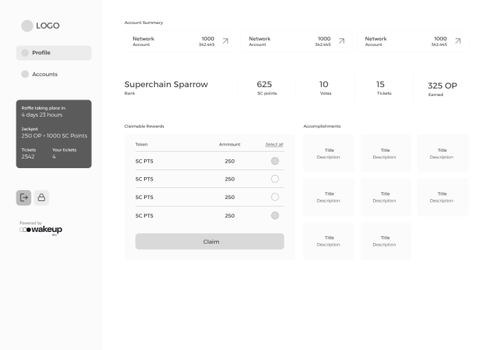
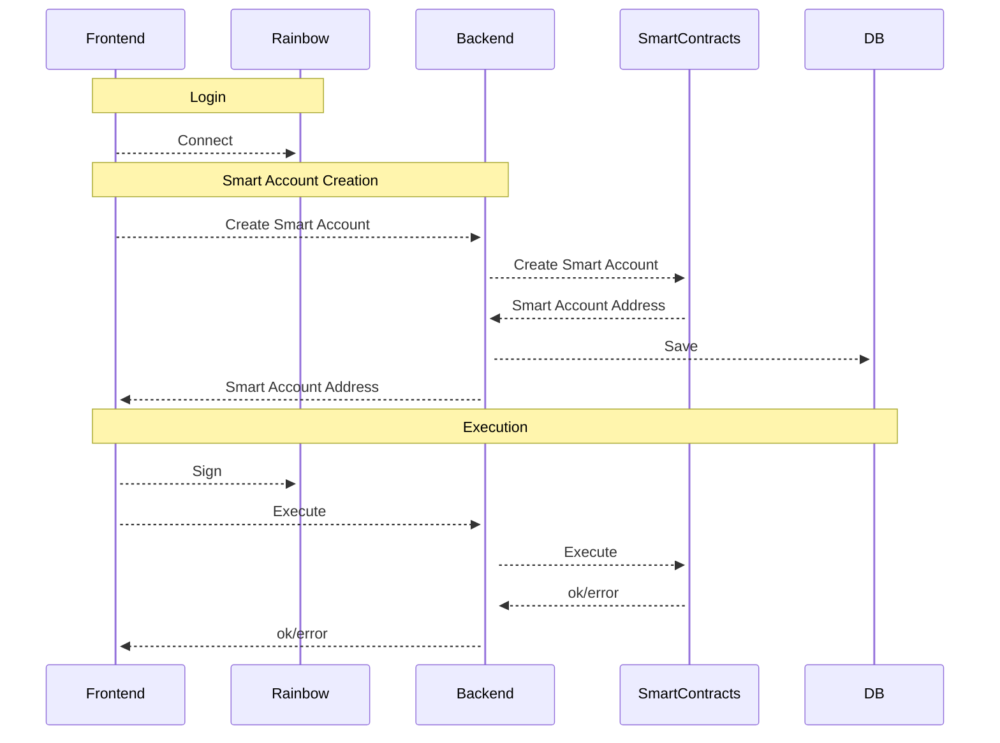
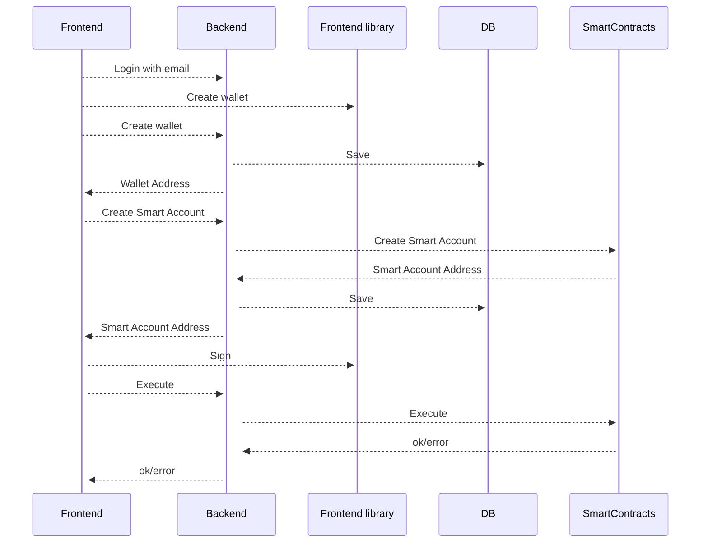
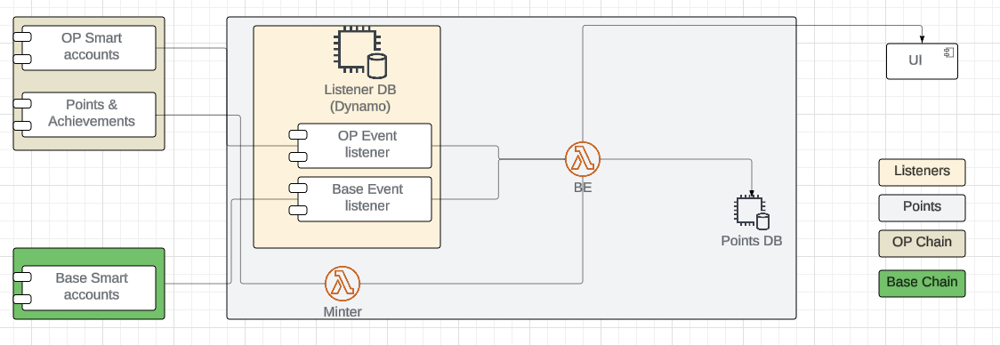

# Optimism - Superchain Accounts

## Overview

Accelerating meaningful participation in the Superchain Ecosystem.
**Mission:** https://gov.optimism.io/t/ready-to-vote-superchain-accounts/7427

The purpose of this project is to enhance participation across Optimism Chains by using Smart Accounts. This type of account works like a regular EOA but abstracts users from its management, so they do not have to worry about creation, recovery, or gas.
In addition, the project will implement a reward program that grants users different perks and badges based on their activity.

## Glossary

- Smart Accounts (SA): Accounts designed with smart contract logic that provide functionalities such as programmable transaction validation, batch processing, and abstraction of gas fees.
- Superchain Account (SCA): A dynamic user account within the Optimism ecosystem(multi-chain).
- Externally Owned Accounts (EOA): EOAs serve as the gateway to the Ethereum network, facilitating the basic but vital functions of sending, receiving, and managing digital assets. While they offer simplicity and control, users must take precautions to safeguard their private keys. EOAs are user-friendly and offer complete control to users through private keys.

## Purpose

This project aims to enhance participation across OP Chains by using Smart Accounts. This type of account works like a regular EOA but abstracts users from its management, so they do not have to worry about creation, recovery, or gas.
In addition, the project will implement a reward program that grants users different perks and badges based on their activity.

- SuperChain Points may be issued as non-transferable ERC-20 tokens, enhancing the amount of on-chain transactions and enabling their tracking on the blockchain.
- Claimable Badges will be non-transferable ERC-721, enhancing the amount of on-chain transactions and enabling their tracking on the blockchain.
- SuperChain Accounts might be dynamic ERC-721 NFTs, symbolizing the user's achievements and level.

# Use cases

- **Create a Smart Account:** Simplified process for new users to generate and activate a blockchain account with minimal technical knowledge.
- **Recover a Smart Account:** Secure and user-friendly recovery options for lost or inaccessible accounts.
- List Tokens and Activity on Each Chain: Display a comprehensive overview of tokens and transaction history across all connected Optimism chains.
- **Send Tokens:** Seamless token transfers with gas abstraction to enhance user convenience.
- **Receive Tokens:** Effortless token reception with real-time notifications and activity logging.
- **Add Tokens:** Enable users to manually or automatically add new tokens to their account interface.
- **Claim Points and Achievements:** Users can redeem Superchain Points and unlock badges for completed milestones or specific activities.

## Wire frames

The following wireframes have been designed to illustrate the structure and user flow for the implementation of Smart Accounts and Superchain Accounts, highlighting key interactions and functionalities:

1. Login and connect wallet.  

**Description:**
- A simple login screen allowing users to connect their wallet.
- Highlights a secure and user-friendly interface to onboard users into the ecosystem.

2. Account with activity splitted by chain.  

**Description:**
- A dashboard displaying the user’s Smart Account and its activity segmented by different Optimism chains.
Features include token balances, recent transactions, and activity logs for each chain.
- Users can navigate to specific chains to explore detailed activity or manage tokens.

3. Summarize of points and achievements.  

**Description:**
- A profile page summarizing the user's Superchain Points, earned badges, and achievements.
- Visual elements include detailed milestone tracking and a section for claiming rewards.

# Technical plan

## Smart Accounts Implementation

## Authentication

The application aims to provide users with a seamless experience for creating, recovering, and interacting with their superchain accounts. At a high level, the system architecture is composed of four core components: a frontend, a backend,the smart contract solutions and a database. For the purposes of discussing the authentication feature, this high-level overview suffices, as the document will provide in-depth descriptions of each component in subsequent sections.

### Rainbow kit login

It adopts a non-custodial solution, ensuring users retain full control over their private keys. Each Smart Account is associated with an owner, represented by their wallet address. Transactions are signed by the user, enabling the Smart Account to validate that incoming operations originate from the rightful owner.

To facilitate wallet integration, the system leverages RainbowKit, allowing users to connect a wallet of their choice.

#### Why this approach?

This approach is a good choice for several reasons:

**1. Enhanced Decentralization**
By adopting a non-custodial model, the system stays true to the core principles of blockchain technology, empowering users with full control over their private keys and account security. It minimizes reliance on centralized entities, reducing points of failure and potential vulnerabilities.

**2. Improved Security**
Delegating the responsibility of private key management to users ensures that the platform itself does not hold sensitive information. This reduces the risk of large-scale security breaches, as the platform becomes less attractive to attackers.

**3. Flexibility and User Autonomy**
Users can connect the wallet of their choice using tools like RainbowKit, providing flexibility and catering to diverse wallet preferences. This freedom empowers users to maintain a consistent experience across multiple platforms.

This approach is particularly suitable for an initial implementation, as it prioritizes decentralization and security while keeping the architecture simple.

### Non-wallet solution

The second implementation simplifies the user onboarding process by enabling the creation of Super Chain Accounts without requiring users to have a pre-existing wallet. This approach abstracts the wallet management process, allowing users to authenticate using familiar methods such as email login.
Once the wallet is created, the process for interacting with SmartAccounts mirrors that of users who connect external wallets. This consistency reduces complexity and ensures a uniform backend handling for both user groups.

//TODO: improve the diagram when we have define the technology

### Key Features of This Solution:

**1. User-Friendly Abstraction**
Users can create their accounts with minimal technical understanding. The system abstracts wallet generation and management, enabling authentication via familiar methods such as email.

**2. On-Demand Wallet Creation**
A wallet is automatically generated and associated with the user during the onboarding process, streamlining the experience.

**3. Potential for Broader Adoption**
By removing the barrier of requiring a pre-existing wallet, this solution can appeal to a broader audience, including non-crypto-savvy users, expanding the platform's user base.

This approach builds on the foundation of the non-custodial model while incorporating a managed wallet abstraction to make blockchain technology more accessible. As a result, it balances decentralization with usability and sets the stage for greater adoption.

### Libraries:

**1. Leverage Web3Auth**
Use Web3Auth to handle login and wallet creation. This solution utilizes the wallet generated during authentication, streamlining the user experience.

**Pro:**

- Provides a seamless and abstracted user experience, allowing users to log in using their preferred method (e.g., email, social login, etc.).

**Cons:**

- Centralized solution, which may not align with decentralized principles.
- it is a paid services.

**2. Implement Custom Login Using Tools Like Auth0**
Develop a custom login system integrated with tools like Auth0. This approach would require managing wallet creation (Externally Owned Accounts, or EOAs) as part of the onboarding process.

**Pro:**

- Offers flexibility to align with OP's requirements and adapt to specific platform needs.

**Cons:**

- Increased development effort due to the need to create and manage wallets securely, including implementing robust mechanisms to ensure security.
- Auth0 is a paid service, which adds operational costs.

## Points Strategy

[Read the disclaimer](points/disclaimer.md)

---

[On this link](./points/events.md) the points/events strategies are listed.

This approach to collecting points involves an off-chain activity tracking mechanism, combined with on-chain rewards issuance, offering flexibility in recognizing and rewarding user actions across multiple blockchains. Here's how it works in overview:

[Learn more about the Web2 integration and details here](./points/web2.md)

### Components

#### **UI**

The user interface provides a seamless way for users to interact with the system. It enables users to access and manage all features effortlessly, ensuring a user-friendly experience.

#### **Backend (BE)**

The backend serves as the central coordinator, processing events received from different chains. Its primary responsibilities include:

- Parsing events into corresponding points.
- Filtering and organizing data to support various UI features, such as ranking systems.

#### **Minter**

The **Minter** component handles the conversion of points into tokens. While it is shown as a separate entity in the diagram for clarity, it could be integrated into the backend depending on the implementation requirements.

#### **Listeners**

Listeners form a critical and complex part of the architecture. Each chain requires a dedicated listener instance, configured to monitor specific events tied to milestones for earning points. This component ensures accurate event detection and points attribution across multiple chains.

#### **Smart Accounts**

Smart accounts are deployed on each chain which the user wants. [Click here](./superchain-implementation.md) for more information about the technical implementation.

#### **Points & Achievements**

An implementation for representing the points in the blockchain will be implemented in OP chain.

- SuperChain Points may be issued as non-transferable ERC-20 tokens, enhancing the amount of on-chain transactions and enabling their tracking on the blockchain.
- Claimable Badges will be non-transferable ERC-721, enhancing the amount of on-chain transactions and enabling their tracking on the blockchain.
- SuperChain Accounts might be dynamic ERC-721 NFTs, symbolizing the user's achievements and level.

**Pros:**

- Enables retrieval of historical points for any Smart Chain Account (SCA).
- Offers flexibility to change strategies dynamically without affecting the overall system.

**Cons:**

- Infrastructure-heavy and costly: Requires a dedicated event listener per chain.
- Demands a database for storing and managing points data.
- Necessitates designing a robust backend to orchestrate the entire process.

## Alternatives

Using a custom event listener for monitoring blockchain activity through an active WebSocket connection offers high flexibility but also comes with significant infrastructure overhead. Let’s compare it to using subgraphs, which can achieve similar outcomes with different trade-offs.

### Comparison: Custom Event Listener vs. Subgraphs

#### **Custom Event Listener Approach**

##### How It Works:

- Establishes a WebSocket connection with blockchain nodes to receive real-time updates on transactions and events of interest.
- Listeners monitor specific events or interactions involving predefined addresses or contracts.
- Data is processed and stored off-chain for further use.

##### Advantages:

1. **Real-Time Tracking**: Immediate updates without latency from querying.
2. **Custom Logic**: Fully customizable for monitoring specific conditions or uncommon events.
3. **Cross-Chain Support**: Can connect to multiple blockchains if the infrastructure supports it.

##### Challenges:

1. **Infrastructure Complexity**: Requires dedicated servers, node synchronization, and scalability planning.
2. **Maintenance Overhead**: Must handle node updates, network interruptions, and scaling as data volume grows.
3. **Higher Cost**: Infrastructure for WebSocket nodes, databases, and processing pipelines can be expensive.

---

#### **Subgraph Approach**

##### How It Works:

- Subgraphs use indexing services (e.g., The Graph) to preprocess and store blockchain data in a queryable format.
- Developers define a schema and mappings for the data to track. These mappings extract data from the blockchain as it is indexed.
- A GraphQL API is exposed for querying events or state changes.

##### Advantages:

1. **Simplified Infrastructure**: No need to maintain dedicated nodes or handle event listeners manually.
2. **Scalability**: Managed indexing services reduce the load on your system as data grows.
3. **Query Flexibility**: Provides a user-friendly GraphQL API for accessing indexed data.
4. **Cost-Effective**: Often cheaper than maintaining custom infrastructure, especially for smaller-scale use cases.

##### Challenges:

1. **Indexing Latency**: Subgraphs do not provide real-time updates; there is a small delay as data is indexed.
2. **Platform Dependency**: Relies on external indexing services (like The Graph), which may introduce limitations or risks.
3. **Limited Customization**: Subgraphs are primarily designed for predefined schemas and event mappings, which may not cover highly specialized use cases.

---

## **Comparative Analysis**

| Feature                  | Custom Event Listener           | Subgraphs                      |
| ------------------------ | ------------------------------- | ------------------------------ |
| **Real-Time Capability** | ✅ Real-time updates            | ⚠️ Slight delay in indexing    |
| **Ease of Use**          | ⚠️ Requires custom setup        | ✅ Simplified via GraphQL      |
| **Scalability**          | ⚠️ Requires manual handling     | ✅ Managed infrastructure      |
| **Flexibility**          | ✅ Fully customizable           | ⚠️ Limited by subgraph schema  |
| **Cost**                 | ⚠️ Higher (infrastructure)      | ✅ Lower (platform-managed)    |
| **Cross-Chain Support**  | ✅ Full control with more infra | ⚠️ Depends on subgraph support |

---

#### **Key Considerations**

- Use **Custom Event Listeners** for real-time tracking and highly specialized use cases requiring advanced customization.
- Opt for **Subgraphs** when cost-efficiency, scalability, and ease of setup are priorities, and slight indexing delays are acceptable.